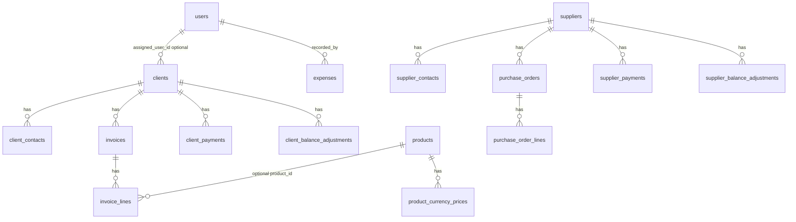

# نظرة شاملة على النظام — غاز اليمين

> **الغرض:** وصف **الحالة الفعلية للتطبيق** (مسارات، نماذج، تجميعات لوحة التحكم، سياسات) لمرجع الفريق دون تكرار مواصفة المفاهيم بالكامل؛ للتفاصيل المنطقية للجداول راجع `docs/03_DATABASE_SPEC.md`. للمصفوفة التقريرية راجع `docs/04_REPORTS_AND_UI_MATRIX.md`. **لتسويات الذمة وكشف الحساب:** `docs/09_BALANCE_ADJUSTMENTS_AND_STATEMENTS_AR.md`.

---

## 1) المكدس والتشغيل

| الطبقة | التقنية |
|--------|---------|
| الباكند | Laravel (PHP 8.2+)، Eloquent، مسارات `routes/web.php` + `routes/auth.php` |
| الواجهة | Blade + Livewire 3 + Alpine.js + Tailwind، اتجاه RTL وعربية في الواجهة |
| المصادقة | جلسة Laravel، حماية المسارات بـ `middleware(['auth'])` |

---

## 2) المستخدمون والأدوار

النموذج: `App\Models\User` — الحقول تشمل `role` و`is_active`.

| الدور (`role`) | المعنى التشغيلي |
|----------------|------------------|
| `manager` | أوسع صلاحيات؛ حذف كيانات حساسة حيث يُفرض في المسارات أو السياسات |
| `accountant` | إنشاء وتعديل المستندات المالية (فواتير، دفعات، مصروفات، منتجات، …) |
| `viewer` | عرض غالب الشاشات دون تعديل المستندات المحمية بـ `isAccountant()` |

**دوال مساعدة في `User`:**

- `isAccountant()`: يعيد `true` لـ **المحاسب والمدير** (يُستخدَم لإنشاء/تعديل الفواتير وغيرها).
- `isManager()`: **المدير فقط** (حذف عملاء، مصروفات، دفعات، موردين، … حسب المسار).
- `isViewer()`: المشاهد فقط.

---

## 3) خريطة المسارات (واجهات الإنتاج)

جميع المسارات أدناه (عدا `/login`) داخل مجموعة `auth`.

| المسار (أمثلة) | الاسم (`route()`) | ملاحظات صلاحية |
|------------------|-------------------|------------------|
| `/` | إعادة توجيه إلى `dashboard` | — |
| `/dashboard` | `dashboard` | لوحة تشغيل غاز: اليوم + مخزون/أسطول + ملخص ILS مختصر + صناديق مطوية (`DashboardSummaryService`) |
| `/profile` | `profile` | الملف الشخصي وتغيير كلمة المرور (كل الأدوار بما فيها السائق) |
| `/financial-summary` | `financial-summary` | **صفحة مستقلة** لصناديق العملات (عرض دائم للمجاميع حسب العملة) |
| `/clients` … | `clients.*` | إنشاء/تعديل: محاسب؛ حذف: مدير؛ كشف/PDF: سياسة العميل |
| `/invoices` … | `invoices.*` | إنشاء/تعديل: محاسب؛ طباعة: مسار عام ضمن `auth` |
| `/payments` … | `payments.*` | إنشاء/تعديل: محاسب؛ حذف: مدير |
| `/client-adjustments` … | `client-adjustments.*`, `clients.adjustments.*` | قائمة وتسجيل **تسويات العملاء**؛ محاسب؛ حذف: مدير |
| `/supplier-adjustments` … | `supplier-adjustments.*`, `suppliers.adjustments.*` | **تسويات الموردين**؛ نفس الصلاحيات |
| `/products` … | `products.*` | سياسة `Product` (إنشاء/تعديل محاسب؛ حذف مدير) |
| `/expenses` … | `expenses.*` | إنشاء/تعديل: محاسب؛ حذف: مدير |
| `/suppliers` … | `suppliers.*` | إنشاء/تعديل: محاسب؛ حذف: مدير |
| `/purchase-orders` … | `purchase-orders.*` | سياسة `PurchaseOrder` + محاسب للنماذج |
| `/supplier-payments` … | `supplier-payments.*` | إنشاء/تعديل: محاسب؛ حذف: مدير |
| `/reports/client-receivables-aging` | `reports.client-receivables-aging` | `Gate`: عرض لأي مستخدم نشط؛ تصدير CSV للمحاسب/المدير |
| `/legacy-catalog/products` | `legacy-catalog-products.index` | سياسة `LegacyCatalogProduct`؛ **مسار حي** قد لا يظهر في القائمة الجانبية |
| `/income-entries` … | `income-entries.*` | **إعادة توجيه** إلى `payments.index` مع تنبيه (الإيراد النقدي عبر دفعات العملاء فقط) |
| `/users` … | `users.*` | **المدير فقط** |

---

## 4) مكوّنات Livewire (ربط العرض)

| الشاشة | المكوّن |
|--------|---------|
| عملاء | `client-list`, `client-form` |
| فواتير | `invoice-list`, `invoice-form` |
| دفعات عملاء | `payment-list`, `payment-form` |
| تسويات عملاء | `client-adjustment-list`, `client-adjustment-form` |
| تسويات موردين | `supplier-adjustment-list`, `supplier-adjustment-form` |
| منتجات مبيعات | `product-list`, `product-form` |
| مصروفات | `expense-list`, `expense-form` |
| موردون | `supplier-list`, `supplier-form` |
| أوامر شراء | `purchase-order-list`, `purchase-order-form` |
| دفعات موردين | `supplier-payment-list`, `supplier-payment-form` |
| كشوف | `client-statement`, `supplier-statement` |
| تقرير ذمم | `client-receivables-aging-report` |
| أرشيف كتالوج | `product-catalog-list` |
| مستخدمون | `user-list`, `user-form` |
| الملف الشخصي | `profile-page` |
| سجل مبيعات الغاز | `sale-list` |
| حركات المخزون | `stock-movement-list` |

> ملفات العرض تحت `resources/views/` تستدعي المكوّنات أعلاه؛ لوحة التحكم `resources/views/dashboard.blade.php` تستدعي `App\Services\DashboardSummaryService` ثم جزئية `partials/currency-boxes-full` لتفاصيل الصناديق (مطوي). الملف الشخصي: `livewire:profile-page`.

---

## 5) الجداول والعلاقات (ملخص تنفيذي)

- **العملاء:** `clients` ← `client_contacts`
- **الموردون:** `suppliers` ← `supplier_contacts`
- **المبيعات:** `invoices` ← `invoice_lines` (حقل اختياري `product_id` → `products`)
- **المنتجات:** `products` ← `product_currency_prices` (تسعير لكل عملة مدعومة)
- **التحصيل:** `client_payments` → `clients`
- **تسويات العملاء:** `client_balance_adjustments` → `clients` (خصم/إعفاء على الذمة **دون** تعديل الفاتورة)
- **المشتريات:** `purchase_orders` ← `purchase_order_lines` → `suppliers`
- **دفعات الموردين:** `supplier_payments` → `suppliers`
- **تسويات الموردين:** `supplier_balance_adjustments` → `suppliers`
- **اليومية:** `expenses` (مع `recorded_by_user_id` → `users`)؛ جدول `income_entries` قد يبقى في المخطط لكن **واجهة المسارات الحالية** تدمج الإدخال مع دفعات العملاء
- **أرشيف:** `legacy_catalog_products` (قراءة/بحث؛ ترحيل إلى `products` عبر أمر Artisan)
- **هوية:** `users`

### مخطط علاقات (Mermaid — مبسّط)

---

## 6) لوحة التحكم (تشغيل الغاز) والملخص المالي

**الملفات:**

- `app/Services/DashboardSummaryService.php` — تجميع مؤشرات اليوم والمخزون والذمم المختصرة (ILS) مع حماية من الأعطال.
- `resources/views/dashboard.blade.php` — عرض اللوحة.
- `resources/views/financial-summary.blade.php` — صفحة «الصناديق النقدية» الكاملة.
- `resources/views/market-debt/index.blade.php` + `MarketDebtPage` — شاشة **دين السوق** (بلا عملاء).
- `resources/views/partials/currency-boxes-full.blade.php` — تفاصيل صناديق السائقين والصندوق الرئيسي (مطوي في اللوحة).
- توثيق الجلسات: `docs/18_…`، `docs/19_…`، `docs/21_SESSION_PNL_PO_STOCK_VALUATION_2026_08_08_AR.md`.

**أقسام اللوحة (الحالية):**

1. اليوم — توزيع الغاز (مبيعات، تحصيل، مصروفات سائقين، كاش غير مُسلَّم).
2. المخزون والأسطول (أرصدة صفر، تحميل/إرجاع، تسعير يومي، مواقع).
3. ملخص مالي مختصر (ILS) + رابط للصناديق.

**صفحات مالية مكمّلة (خارج اللوحة):** `/financial-summary` (صناديق)، `/market-debt` (دين السوق المجمع).
4. تفاصيل الصناديق (مطوي؛ Alpine `open: false` افتراضياً).

**سلوك قديم ملغى من الواجهة:** بطاقة «عدد الموردين» وحدها؛ اختصارات تشغيلية؛ قائمة «يحتاج انتباه».

**من القائمة الجانبية:** بند **«الصناديق النقدية»** → `/financial-summary`.

**تجميع الصناديق التفصيلي** ما زال في الجزئية `currency-boxes-full` عبر `CashBoxService` (رئيسي حسب العملة + صناديق السائقين + شيكات + مصروفات حديثة).

**مهم:** لا تُجمَع عملات مختلفة في رقم واحد (دستور المشروع).

---

## 7) السياسات (Policies) والبوابات (Gates)

**التسجيل:** `App\Providers\AppServiceProvider::boot()`

| النموذج | السياسة |
|---------|---------|
| `Client` | `ClientPolicy` |
| `ClientPayment` | `ClientPaymentPolicy` |
| `Invoice` | `InvoicePolicy` |
| `Product` | `ProductPolicy` |
| `PurchaseOrder` | `PurchaseOrderPolicy` |
| `Supplier` | `SupplierPolicy` |
| `SupplierPayment` | `SupplierPaymentPolicy` |
| `LegacyCatalogProduct` | `LegacyCatalogProductPolicy` |

**Gates مخصّصة:**

- `view-client-receivables-aging`: أي مستخدم نشط.
- `export-client-receivables-aging-csv`: `isAccountant()` (محاسب + مدير).

**ملاحظة هندسية:** جزء من الحماية في **`routes/web.php`** عبر `abort_unless(auth()->user()->isAccountant())` وغيره، وجزء في **Policies**. أي تغيير لاحق في الصلاحيات يجب أن يراجع **المسارين** معًا.

---

## 8) ترحيل كتالوج قديم → منتجات مبيعات

**الأمر:** `php artisan catalog:migrate-legacy-products`

**الملف:** `app/Console/Commands/MigrateLegacyCatalogProductsCommand.php`

- يقرأ من `legacy_catalog_products` وينشئ `products` + `product_currency_prices` حيث ينطبق.
- يمنع التكرار عبر `products.imported_from_legacy_catalog_id` (فريد).
- إعادة التشغيل آمنة للسجلات المرتبطة بالفعل.

---

## 9) فجوات مقصودة / مخاطر تشغيلية

1. **لا يوجد** جدول «خزينة» أو يومية نقدية مفصّلة — الموجود تجميعات في لوحة التحكم + شاشات المصدر.
2. **ازدواجية قواعد الصلاحية** بين الراوتر والسياسات (انظر القسم 7).
3. **منطق لوحة التحكم:** انتقل إلى `DashboardSummaryService` (قابل للاختبار)؛ الجزئية المالية التفصيلية للصناديق ما زالت في Blade عبر `CashBoxService`.
4. **`Expense`:** لا سياسة مسجّلة في `AppServiceProvider`؛ الاعتماد على شروط المسارات للحذف/التعديل.
5. **متعدد العملات:** الملخص لا يجمع عملات مختلفة في رقم واحد — يتوافق مع مبدأ عدم الجمع العبري في الدستور.

---

## 10) مراجع داخلية

| الملف | الموضوع |
|-------|---------|
| `docs/03_DATABASE_SPEC.md` | مواصفة منطقية للجداول |
| `docs/04_REPORTS_AND_UI_MATRIX.md` | مصفوفة تقارير ومستقبل واجهات |
| `docs/decisions/ADR-001-backend-laravel-frontend-stack.md` | المكدس المعتمد |
| `.cursorrules` | دستور المشروع والقيود |

---

*آخر مراجعة توثيقية للكود: 2026-05-12.*
